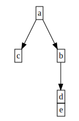

# Vertical DOT Leaves
A python implementation that takes an `anytree Node` (tree) as input and converts it to a **graphviz** (DOT) tree with all leaf-nodes aligned vertically.
```python
dotGraph = verticalDotLeaves.DotGraph(tree)
```

The output will be a DOT-graph, with:
- all leaf-nodes aligned vertically

## When is it useful?

The problem this implementation solves for me is when the input tree has not too complex hierachy but with lots of leaf-nodes.

The original graph that Graphviz creates aligns the leaves horizontally and is too wide to be overviewable. But if I instead align all leaf nodes vertically, the final graph ends up taking a lot less horizontal width.

I found no default option on how to accomplish this using only the graphviz options for DOT-trees.

## Prerequisites
- anytree

## Usage
1. Create the desired tree
```python
# -*- coding: utf-8 -*-
from __future__ import unicode_literals
from anytree import Node, RenderTree

a = Node("a")
b = Node("b", a)
Node("c", a)
Node("d", b) # d
Node("e", b) # e

for pre, _, node in RenderTree(a):
    print("{}{}".format(pre, node.name))

''' outputs:
a
├── b
│   ├── d
│   └── e
└── c
'''
```
2. Create the DOT-graph
```python
import verticalDotLeaves

dotGraph = verticalDotLeaves.DotGraph(a)

print dotGraph
''' outputs:
digraph tree {

node [shape=none];

"a"[label=<
<TABLE BORDER="0" CELLBORDER="1" CELLSPACING="0" PORT="portroot" >
<TR><TD>a</TD></TR>
</TABLE>
>];

"aleaves"[label=<
<TABLE BORDER="0" CELLBORDER="1" CELLSPACING="0" PORT="portroot" >
<TR><TD>c</TD></TR>
</TABLE>
>];

"b"[label=<
<TABLE BORDER="0" CELLBORDER="1" CELLSPACING="0" PORT="portroot" >
<TR><TD>b</TD></TR>
</TABLE>
>];

"bleaves"[label=<
<TABLE BORDER="0" CELLBORDER="1" CELLSPACING="0" PORT="portroot" >
<TR><TD>d</TD></TR>
<TR><TD>e</TD></TR>
</TABLE>
>];

"b":portroot -> "bleaves":portroot;


"a":portroot -> "b":portroot;
"a":portroot -> "aleaves":portroot;

}

'''
```
3. Display the result

To display the result paste in the DOT-tree in at (e.g.):

[https://dreampuf.github.io/GraphvizOnline/]

The result of the output will be:


